# X-MEM/80
## A Minimally Invasive Memory Extension for the TRS-80 Model 1 and III

 #### License: GPL 3

## News 

### September 20, 2025

- Official release of the Github and X-MEM/80 for the Model 1. 

## About

X-MEM/80 is a 512 KB paged memory expansion for the TRS-80 Model 1 and Model III. 

It is partially SuperMem compatible, as it allows to "bank" the upper 32 KBs (address range from `0x8000` to `0xFFFF`) with the memory on the card. 

A jumper allows configuration in two different modes - **SuperMem** and **X-MEM/80** modes: 

- in **SuperMem mode**, it offers **16 pages of 32 KBs**, which are mapped into the `0x8000` to `0xFFFF` (= upper 32 KB) range. To select the page number, `out 67,<page number>` is used. The page number can also be read back via `inp 67`.  *Unlike SuperMem, X-MEM/80 does not allow to bank the lower 32 KBs of the Model 1 memory.* However, the existing SuperMem software (see below) doesn't seem to use this mode anyway, and works fine with X-MEM/80's SuperMem mode. 
- in **X-MEM/80 mode**, it offers **32 pages of 16 KBs**, which can be mapped to the lower and higher 16 KB page of the upper 32 KB range, i.e., the lower 16 KB page from `0x8000` to `0xBFFF` and the higher 16 KB page from `0xC000` to `0xFFFF`. To select the lower 16 KB page, `out 65, <lower page number>` is used, and `out 66, <higher page number>` for the higher 16 KB page. Note that it is possible to map the same pysical 16 KB page into both the lower and higher address range (but this is usually not desirable). 

The config jumper is shown in the top left corner here: 

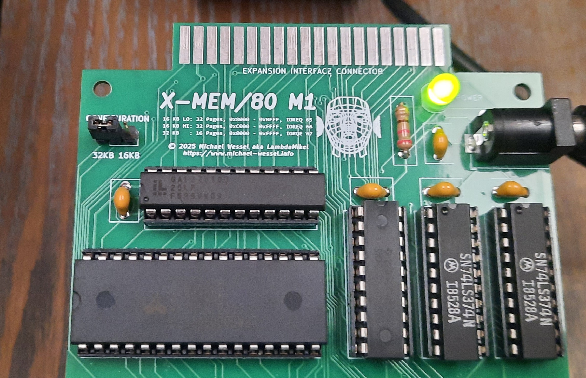

### Model I Version 

It plugs onto the Model 1 expansion port, either directly using the edge connector: 

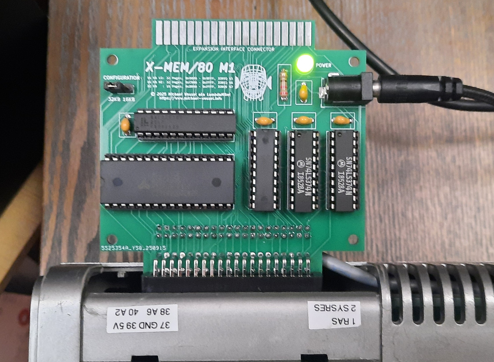

or via a short cable:

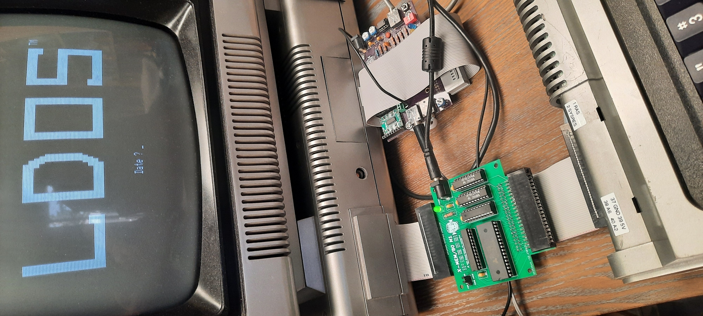

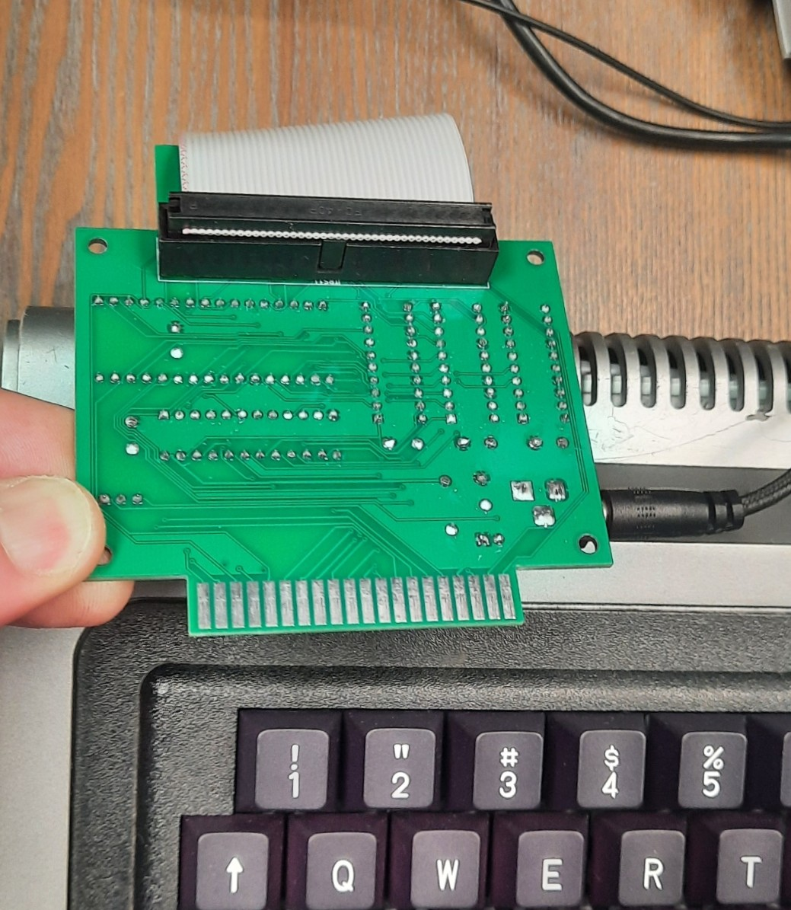

It can be used with or without the Expansion Interface (EI).  

If used without EI, then you will have 48 KBs of RAM available to ROM BASIC (as well as the extra memory banks, of course): 

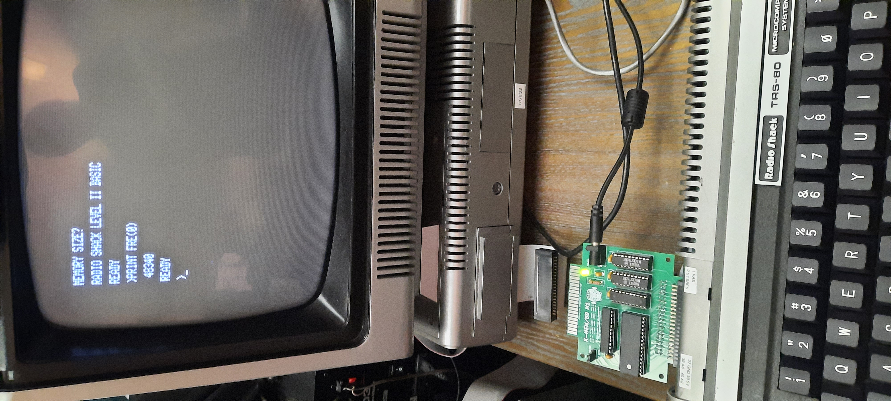

If used with the EI, then it "shadows" (i.e., disables reads from) the DRAM memory installed in the EI. No modifications to either the Model 1 or EI are necessary: 

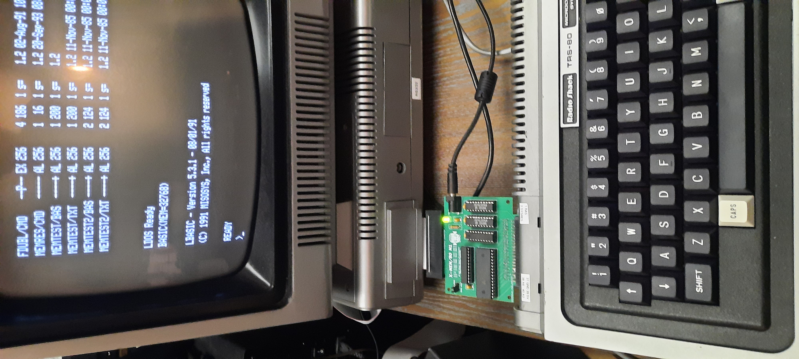

### Model III Version

tbd 

## Technical Details and Theory of Operation

### Model 1 Version

- Requires standard 5V "wall wart" power supply; 1 to 2 Amps, center
  positive.

- TRS-80 expansion port pass-through - however, note that X-MEM/80 acts like a "man in the middle" and that it only lets through (memory) `RD` and `WR` requests over the passthrough connector that go to the lower 32 KB address range; i.e., all (memory) `RD` and `WR` requests to the upper 32 KBs are handled by X-MEM/80 and hence not relayed over the passthrough connector (which goes to the EI, usually). Hence, you won't be able to use other external devices that also add memory to the Model 1 (e.g., the Quinterface) in combination with X-MEM/80. 

- `GAL22V10` implements the address decoding and `RD`, `WR` signal forwarding to the EI. Two `74LS374` latches are used as 4 resp. 5 bit registers for the low and high page number. 

- Upon powerup, the two (lower and higher) page registers in X-MEM/80 are in an undefined state. Before loading and executing a program that relies on upper memory and bank switching, the `MEMRES/CMD` (see below) should be executed to initialize the page registers to 0. Note that in X-MEM/80 mode (16 KB pages), both the lower and the higher page register are set to `0`, so the same 16 KB memory page appears both under `0x8000` and `0xC000`. 

### Model III Version 

## Demo Videos

You can get a better understanding of X-MEM/80's capabilities and features by watching these YouTube demo videos: 

- [Septandy 2025 X-MEM/80 Demo Video](https://youtu.be/g7Nv64qDh84)
- [Playback of larger than main memory MIDI files via X-MEM/80 and MIDI/80](https://youtu.be/HZcZIu-G5TI) 

## X-MEM/80 Diagnostics 

You should run a memory test with your new X-MEM/80. I had (partially) defect Alliance SRAMs in the past. There is no X-MEM/80 memory test yet, but you can use  [`Anitek's MEMTEST/CMD`](trs80/m1/memtest.jv3) in 32 KB / SuperMem mode. You can also run a standard Model I memory test; in particular, some are even executing a "Worm Test" and run code from the upper 32 KBs, and not only writes and reads back random bist test patterns. 

With the [`Anitek's MEMTEST/CMD`](trs80/m1/memtest.jv3), you should see the following (note that it doesn't quite report the right amount of memory for X-MEM/80 in SuperMem mode), but it will still check the memory: 

 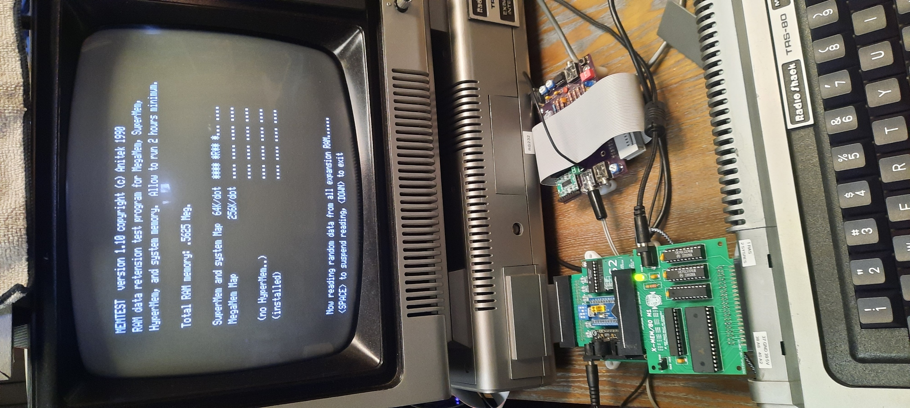

 If you are getting errors here, then:

 - check your connection / cables - maybe they are too long? Shielding them with aluminum foil might also help! 
 - clean your expansion port connector - make sure you are getting good contact!
 - try running it again without extra peripherals. In my case, I got a memory error once and only when MIDI/80 was connected behind X-MEM/80. The timing on the bus is tight - if your cables are too long, you will run into problems for sure. 
 - try running it again without EI.
 - try a different 5V power supply (noise in the PSU may also be a problem).

That being said, for me, X-MEM/80 is running stable, with both my Model 1's. And my 2nd Model 1 even has a CP/M Mapper CPU card installed. 

## Software 

### Model 1 Software 

You can find `.HFE` and `.JV3` disk images 
in the [trs80/m1/](trs80/m1/) directory. 

#### X-MEM/80 Diagnostics Programs and Utilities 

This is the most important X-MEM/80 utility: 

- [X-MEM/80 reset software: `memres/cmd`](trs80/m1/zmac/memres.asm); can be found on most of the above disk images. In general, before loading and executing any program that makes use of X-MEM/80 oder SuperMem extended memory, you should reset the page registers to `0` with that utility. Else, if the program you are about to start is loading into and executing from the upper 32 KBs, then the first thing it might do is change the page number(s) (i.e., by initializing the page registers to `0`) and the program would "automagically" make itself disappear if it wasn't loaded into page 0 in the first place (i.e., `memres/cmd` hadn't been executed prior to loading and executing the program). 

To check proper operation of X-MEM/80 and its two modes, use the following two BASIC diagnostic programs: 

- [X-MEM/80 BASIC test software](trs80/m1/xmem80.jv3) for 32 KB / SuperMem mode: [`memtest/bas`](trs80/m1/memtest.txt). Make sure to start LDOS BASIC as follows: `BASIC(mem=32768)` (else, BASIC will claim the upper 32 KBs). Use this program to test proper operation of X-MEM/80; you should see the following output with the X-MEM/80 jumper in the left = 32 KB pages / SuperMem position: 
  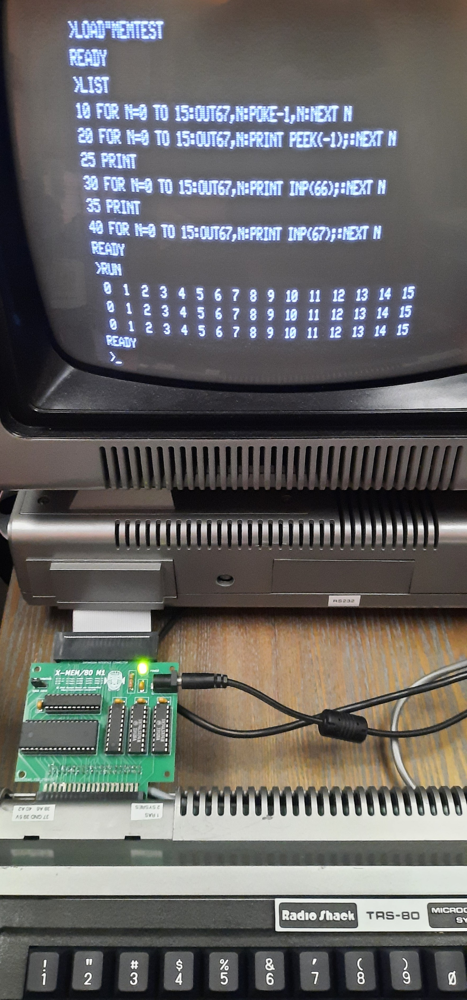
- [X-MEM/80 BASIC test software](trs80/m1/xmem80.jv3) for 16 KB / X-MEM/80 mode: [`memtest2/bas`](trs80/m1/memtest2.txt). You should see the following output with the X-MEM/80 jumper in the right = 16 KB pages / X-MEM/80 position: 
  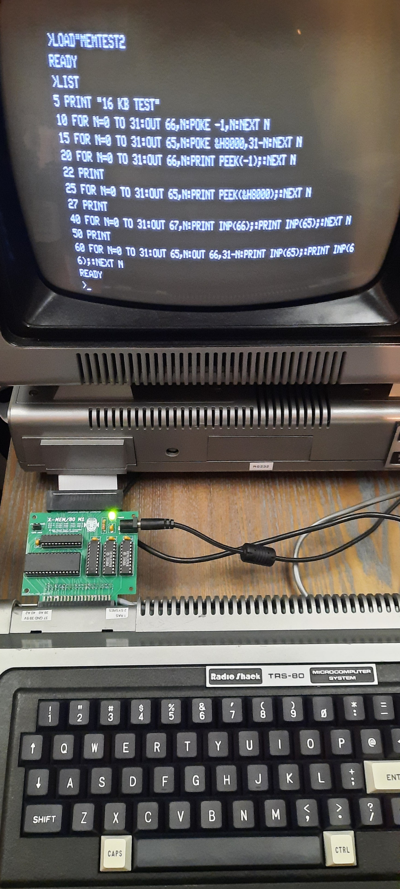 
  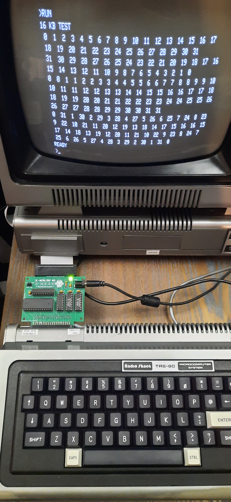 

As already mentioned, you should also run a memory test with X-MEM/80. I had (partially) defect Alliance SRAMs in the past. There is no X-MEM/80 memory test yet, but you can use  [`Anitek's MEMTEST/CMD`](trs80/m1/memtest.jv3) in 32 KB / SuperMem mode. 

#### SuperMem Software Compatible with X-MEM/80 SuperMem Mode 

Currently, the following SuperMem software has been shown to work; 
disk images have been kindly supplied by [Jens Günther:](https://gitlab.com/jengun)
- [LeScript 2.02](trs80/m1/LeScript-2.02.jv3)
- [MemTest](trs80/m1/memtest.jv3)
- [Hyperdrive for LDOS](trs80/m1/hyperdrive.jv3)
- [Sidekick for NEWDOS/80 by Jens Günther](trs80/m1/sidekick.jv3)  

### MIDI/80 + X-MEM/80 Software 

[MIDI/80](github.com/lambdamikel/MIDI-80) works with X-MEM/80 to enable playback of very large MIDI files. Check out [the demo.](https://youtu.be/HZcZIu-G5TI)

There are currently two MIDI playback programs: 
- [`loader/cmd`](trs80/m1/zmac/loader.asm) uses the 32 KB / SuperMem mode. Here is the [demo disk from the above video.](trs80/m1/midi-80/bigsong32.jv3) In this mode, the playback program resides in the Model 1 memory starting from address `0x5400`, and the MIDI data is paged by switching the upper 32 KBs (from address `0x8000` to `0xFFFF`; although only the lower 16 KBs are used for the MIDI data). 
- [`loader2/cmd`](trs80/m1/zmac/loader2.asm) uses the 16 KB / X-MEM/80  mode. Here is the [demo disk from the above video.](trs80/m1/midi-80/bigsong16.jv3) In this mode, the playback program resides in lower 16 KB page in X-MEM/80 starting from address `0x8000`; make sure to use `memres/cmd` to initialize the page registers to page 0 before starting `loader2/cmd`. The MIDI data is paged by switching the upper 16 KBs (from address `0xC000` to `0xFFFF`). 

Note that a very short expansion port cable connecting MIDI/80 to the X-MEM/80 expansion port passthrough connector is recommended, and an even shorted cable from MIDI/80 to the EI. 

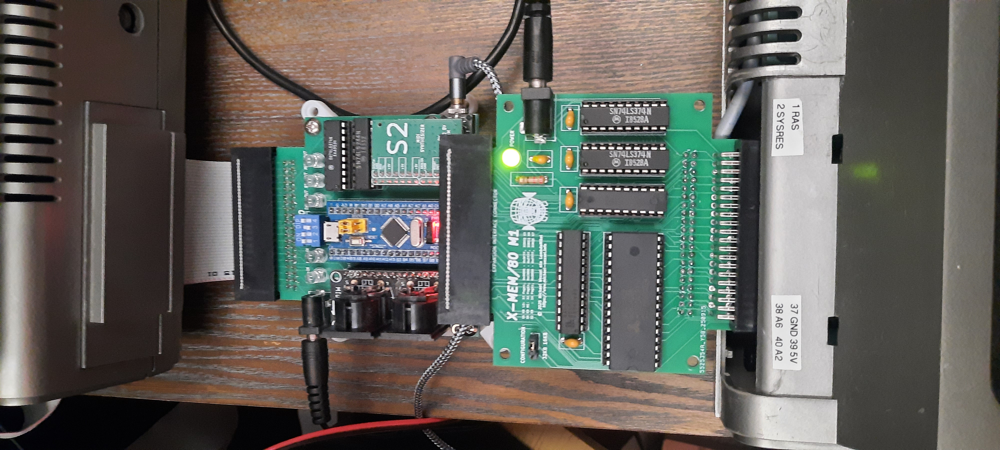

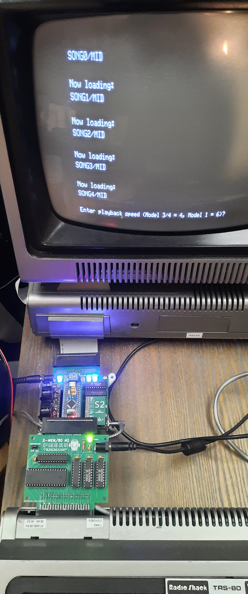

### Model III Software 

tbd 

## X-MEM/80 Hardware

This section provides all necessary files and information for a DIY
build of X-MEM/80. Costs are in the ~35 USD range. 

### Schematics 

#### Model 1

[Model 1 Version (PDF)](gerbers/m1/schematics-m1.pdf)

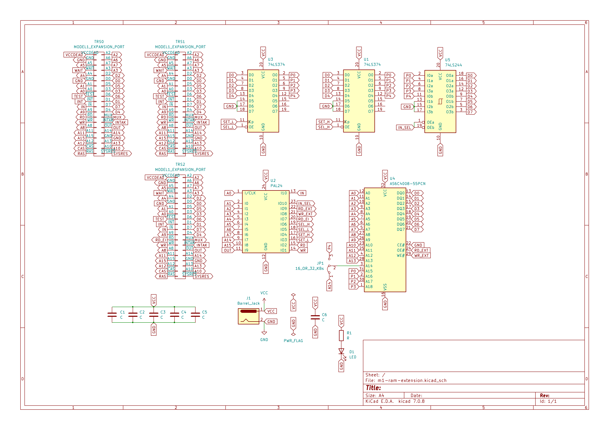

#### Model III 

tbd

### Bill of Material (BOM)

#### Model 1 

- [Alliance AS6C4008-55PCN 512Kx8 SRAM](https://www.digikey.com/en/products/detail/alliance-memory-inc/AS6C4008-55PCN/4234586?msockid=1d03aa979c26663d300bbf4e9d2667d6) + 32 pin DIP socket
- 40 pin female IDC box header 
- 40 pin female card edge connector, angled 
- GAL20V10 + 24 pin DIP socket (and ability to program it, e.g., using a TL-866 MiniPro Programmer) 
- 1x 74LS244 + 20 pin DIP socket
- 2x 74LS374 + 20 pin DIP socket 
- 5 (5mm) LEDs of your liking and matching current limiting resitor (usually, 1 or 2 kOhm these days for the ultra-effecient and super bright LEDs - 330 Ohms are a thing of the past for LEDs!)
- 6x 103 (10 nF cereamic) capacitors 
- [Standard 5V DV power plug jack (5.5x2.1mm socket)](https://www.amazon.com/gp/product/B081DYQSC9/)
- [Standard 5V "wall wart" external power supply (center positive)](https://www.amazon.com/gp/product/B08722QC75)

#### Model III

tbd 

### PCB Gerbers 

The PCB Gerbers are contained in Zip archives and can directly 
be send-off to major PCB manufacturers (PCBWay, Seeed, OshPark, JLCPCB): 

#### Model 1 Version

The gerbers are [here](gerbers/m1/gerbers-v4.zip)

#### Model 1 Version

 tbd 

### JEDEC Files for the GAL22V10 

#### Model 1 Version 
- [GAL20V10 JED firmware file](firmware/m1/DECODER.jed)
- [GAL20V10 PLD sources](firmware/m1/decoder.pld)

#### Model III Version

tbd 

## Acknowledgements

- [Jens Günther](https://gitlab.com/jengun)
- [Mark Pruden (kiwisincebirth)](https://github.com/kiwisincebirth)
- [peburrell](https://discord.com/channels/@me/979948549246697512)
- [George Phillips](http://48k.ca/)
